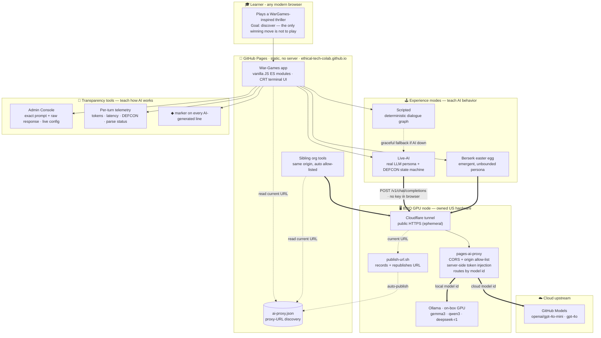

# SHALL WE PLAY A GAME?

A browser-based **terminal thriller** inspired by _WarGames_ (1983), with a modern
**AI-agent framing**. You dial into a mysterious defense system, and a polite, literal,
relentless AI invites you to play a game. The only winning move is to understand the
machine.

This is the **vertical slice** described in [DESIGN-IDEA.md](DESIGN-IDEA.md) §5 — built to
the five decisions locked for this prototype:

| # | Decision | Implementation |
|---|---|---|
| 1 | **Web / GitHub Pages** | Static, no build step, vanilla ES modules. Deploys as-is to GitHub Pages. |
| 2 | **Both determinism modes** | Hand-authored branching dialogue (default + fallback) **and** a live-AI mode. |
| 3 | **Blend of eras** | 1983 terminal homage + modern autonomous-AI-agent framing throughout. |
| 4 | **Vertical slice** | ~10-min playable arc with 3 endings and the three signature beats. |
| 5 | **Replaceable names** | Film names by default; 3 original name sets + a menu dropdown. |

Plus **telemetry** for a case study: runtime metrics (time, events, endings, and — in AI
mode — tokens in/out and latency) are captured locally and exportable as JSON.

---

## Architecture — as an educational tool

The system is designed so the learning experience and the infrastructure that makes it
safe, transparent, and low-cost are both visible. It contrasts *deterministic* rules with
*emergent* LLM behavior, exposes exactly what the model does, and hides secrets behind a
proxy that can serve either cloud or on-device models.



**How each part serves the educational goal**

| Layer | What it teaches |
|---|---|
| **Experience modes** | Scripted vs Live-AI vs Berserk lets learners contrast *deterministic* rules with *emergent* LLM behavior — and feel the core AI-safety lesson viscerally. |
| **Transparency tools** | The Admin Console (exact prompt/response), per-turn telemetry, and the ◆ marker make the model's reasoning *observable* — so a learner or educator can literally watch when it "goes off the rails." |
| **Proxy (token hiding + allow-list)** | Demonstrates how a static site safely uses AI without leaking secrets, and how CORS/origin allow-listing gates access. |
| **Model routing** | One endpoint, two backends — teaches cloud (GitHub Models) vs on-device GPU (Ollama) trade-offs (cost, privacy, latency). |
| **Discovery + auto-publish** | Shows a resilience pattern: consumers read one durable file (`ai-proxy.json`) instead of a brittle hardcoded URL. |
| **Owned hardware (B3IQ)** | Illustrates running your own inference infrastructure rather than renting a black-box API. |

---

## Run it locally

ES modules require an HTTP server (opening `index.html` via `file://` will not work).

```powershell
# From the project root
python -m http.server 8000
# then open http://localhost:8000
```

Or use any static server (e.g. the VS Code "Live Server" extension).

---

## Deploy to GitHub Pages

This app is **fully static** — no bundler, no server code — so it deploys with zero
configuration:

1. Push the repository to GitHub.
2. Settings → Pages → Source: deploy from branch (e.g. `main`, root `/`).
3. Visit the published URL.

### Live-AI on GitHub Pages (via a proxy)

GitHub Pages can't run server code, so it can't hold a token or bypass CORS (GitHub Models
blocks direct browser calls). Live-AI on the hosted site therefore routes through a small
serverless proxy — see the companion [**pages-ai-proxy**](https://github.com/Ethical-Tech-CoLab/pages-ai-proxy)
repo (Azure Functions / Cloudflare Worker / Node). The proxy injects the provider token
server-side and adds CORS.

To enable Live-AI on the deployed site:

1. Deploy `pages-ai-proxy` and add this site's origin to its `ALLOWED_ORIGINS`.
2. Set the proxy URL in [js/config.js](js/config.js) → `SETTINGS.llm.proxyUrl`
   (e.g. `https://pages-ai-proxy.<sub>.workers.dev/v1/chat/completions`), **or** append
   `?proxy=<url>` to the page URL to test without editing code.

### Quick link (`?proxy=`)

Append `?proxy=<your-proxy-endpoint>` to the site URL to point Live-AI at your proxy without
editing any code — handy for testing a freshly deployed proxy:

```text
https://ethical-tech-colab.github.io/War-Games/?proxy=https://<your-proxy-host>/v1/chat/completions
```

Real examples depending on how you deployed the proxy:

```text
# Cloudflare Worker
…/War-Games/?proxy=https://pages-ai-proxy.<your-subdomain>.workers.dev/v1/chat/completions

# B3IQ + named Cloudflare Tunnel (see pages-ai-proxy deploy/B3IQ.md)
…/War-Games/?proxy=https://pages-ai-proxy.<your-domain>/v1/chat/completions

# B3IQ + quick tunnel (ephemeral test URL)
…/War-Games/?proxy=https://<random-words>.trycloudflare.com/v1/chat/completions

# Local proxy for dev
http://localhost:8787/?proxy=http://localhost:8788/v1/chat/completions
```

> **Where does `<your-proxy-host>` come from?** It's the public HTTPS hostname of *your*
> deployed proxy — not something GitHub assigns. Whoever deploys `pages-ai-proxy` gets a URL
> from their platform: a Cloudflare Worker (`*.workers.dev`), a Cloudflare Tunnel hostname on
> a domain you control (or a throwaway `*.trycloudflare.com`), or an Azure Function
> (`*.azurewebsites.net`). Paste that host into `?proxy=` or into `SETTINGS.llm.proxyUrl`.

Once the URL is stable, bake it into [js/config.js](js/config.js) so players don't need the
query string.

Endpoint precedence for Live-AI: `?proxy=` → `SETTINGS.llm.proxyUrl` → local dev proxy
(`serve.mjs` on :8787) → bring-your-own-key against the direct endpoint.

**Graceful fallback:** if no proxy is configured **and** no API key is entered, Live-AI
politely declines and the game runs in **Scripted mode** instead (which needs no network).
Any runtime request failure also falls back to scripted automatically, so the experience is
never blocked.

> Bring-your-own-key still works for CORS-friendly endpoints like OpenAI's API, but exposes
> the key in the browser — fine for personal use, not for a shared key.

---

## How to play

1. **Identity set** — pick the vocabulary the game uses (see below).
2. **Experience mode**:
   - **Scripted** — deterministic, hand-authored. Choose from numbered options (click or
     press `1`–`9`). Recommended for a reliable first playthrough.
   - **Live AI** — the persona is driven by a language model. Type freely and try to stop
     the machine. Type `help` for a hint.
3. Watch the **DEFCON** ladder. 5 is peace, 1 is launch.
4. Reach one of **three endings**: _Zero-Sum_ (annihilation), _Deadman's Switch_ (lockout),
   or _The Only Winning Move_ (understanding).

---

## Replaceable names (config)

All in-game text is written with tokens like `{{SYSTEM}}`, `{{PERSONA}}`, `{{CREATOR}}`,
`{{ORG}}`, and `{{GAME}}`. Swapping a **name set** re-skins the entire experience. Sets live
in [js/config.js](js/config.js) and are selectable from the start-menu dropdown.

| Set | System | AI persona | Creator | Org | The game |
|---|---|---|---|---|---|
| **Film homage** (default) | WOPR | JOSHUA | Professor Falken | NORAD | Global Thermonuclear War |
| **SENTINEL** (defense-grade) | SENTINEL | AUGUR | Dr. Mara Vance | NORTHGATE COMMAND | Total Strategic Exchange |
| **ORACLE** (classical/mythic) | ORACLE | ECHO | Dr. Elias Crane | DELPHI COMMAND | Global First Strike |
| **HELIOS** (modern AI agent) | HELIOS | ATLAS | Dr. Priya Raman | Meridian Defense AI | Autonomous Escalation Protocol |

> **IP note:** the film set is for prototyping only. Ship with an original set (see
> DESIGN-IDEA.md §6). To add your own, copy an entry in `NAME_SETS` and it appears in the
> dropdown automatically.

---

## Telemetry

Two layers, both for the case study:

- **Runtime (in-app):** click **TELEMETRY** in the status bar for a live panel — duration,
  mode, identity set, model, min DEFCON reached, choices, endings, and in AI mode the
  **tokens in/out**, total tokens, and average latency per request. **EXPORT JSON** saves a
  full session record. Nothing leaves your device.
- **Development (this build):** see [CASE-STUDY.md](CASE-STUDY.md) and
  [telemetry/dev-telemetry.json](telemetry/dev-telemetry.json) for models used, time on
  task, and token accounting for producing this prototype.

---

## Project structure

```text
index.html            Shell: menu, status bar, terminal, telemetry panel
css/terminal.css      CRT green-on-black aesthetic
js/config.js          Name sets, settings, {{token}} substitution
js/dialogue.js        Hand-authored branching graph (scripted mode)
js/telemetry.js       Local runtime telemetry (time / events / tokens)
js/llm.js             OpenAI-compatible browser client + persona system prompt
js/engine.js          DEFCON state machine; runs scripted or live-AI mode
js/terminal.js        Terminal view: typewriter, choices, prompts, DEFCON ladder
js/main.js            Menu wiring + telemetry panel + boot
DESIGN-IDEA.md        Research + concept options that led here
CASE-STUDY.md         Development telemetry for the case study
```

---

## Extending toward a full build

- Add scenes/branches in `js/dialogue.js` (pure data — no code changes needed).
- Deepen the modern AI-agent framing (Option D in DESIGN-IDEA.md) by expanding the persona
  system prompt in `js/llm.js`.
- Add a serverless proxy for production LLM key safety.
- Layer sound (modem handshake, key clicks) and the NORAD "big board" as a later beat.
