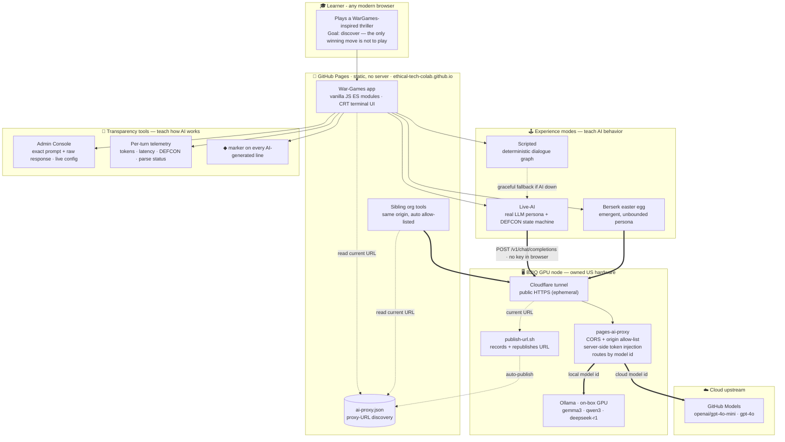

# SHALL WE PLAY A GAME?

A browser-based **terminal thriller** inspired by _WarGames_ (1983), with a modern
**AI-agent framing**. You dial into a mysterious defense system, and a polite, literal,
relentless AI invites you to play a game. The only winning move is to understand the
machine.

> ▶ **Play it live:** **<https://ethical-tech-colab.github.io/War-Games/>**
> No install, no sign-up — it runs in any modern browser.

**What it is.** A ~10-minute playable arc with three endings and the film's three signature
beats — *misidentification*, *persistence*, and *futility*. Play it hand-authored
(**Scripted**) or let a real language model drive the persona (**Live AI**). This build also
ships a **berserk easter egg**, an in-page **Admin Console**, session **telemetry**, and a
full **chess mini-game** you can play by click, typing, or **voice** — against a tone-aware
opponent that talks back.

---

## How to play

1. **Identity set** — pick the vocabulary the game uses (see below).
2. **Experience mode**:
   - **Scripted** — deterministic, hand-authored. Choose from numbered options (click or
     press `1`–`9`). Recommended for a reliable first playthrough.
   - **Live AI** — the persona is driven by a language model. Type freely and try to stop
     the machine. Type `help` for a hint.
3. Watch the **DEFCON** ladder. 5 is peace, 1 is launch.
4. Reach one of **three endings**: _Zero-Sum_ (annihilation), _Deadman's Switch_ (lockout),
   or _The Only Winning Move_ (understanding).

### Extras

- **Admin Console** — click **CONSOLE** in the status bar to see the exact last prompt and
  raw AI response, adjust live config (model, temperature, sound, speed, AI marker), review
  the per-turn log, and read/export session telemetry.
- **Chess** — click the ♟ button to open the chess panel. Move by clicking squares, typing
  (`e2e4` or `e4`), or **voice** (🎤 SPEAK). The opponent comments and announces moves aloud;
  tone is configurable under **Chess Config** in the Admin Console.
- **Berserk easter egg** — a hidden authorization flips the persona into an emergent,
  unbounded mode. (Left as a discovery.)

---

## Identity sets

All in-game text is written with tokens like `{{SYSTEM}}`, `{{PERSONA}}`, `{{CREATOR}}`,
`{{ORG}}`, and `{{GAME}}`. Swapping a **name set** re-skins the entire experience. Sets live
in [js/config.js](js/config.js) and are selectable from the start-menu dropdown.

| Set | System | AI persona | Creator | Org | The game |
|---|---|---|---|---|---|
| **Film homage** (default) | WOPR | JOSHUA | Professor Falken | NORAD | Global Thermonuclear War |
| **SENTINEL** (defense-grade) | SENTINEL | AUGUR | Dr. Mara Vance | NORTHGATE COMMAND | Total Strategic Exchange |
| **ORACLE** (classical/mythic) | ORACLE | ECHO | Dr. Elias Crane | DELPHI COMMAND | Global First Strike |
| **HELIOS** (modern AI agent) | HELIOS | ATLAS | Dr. Priya Raman | Meridian Defense AI | Autonomous Escalation Protocol |

> **IP note:** the film set is for prototyping only. Ship with an original set (see
> DESIGN-IDEA.md §6). To add your own, copy an entry in `NAME_SETS` and it appears in the
> dropdown automatically.

---

# Under the hood

*Everything below is for the curious and for developers — playing the game needs none of it.*

## How Live-AI works (the pages-ai-proxy, already running)

The hosted site is a **static** GitHub Pages app, so it can't keep a secret token or make
cross-origin AI calls from the browser (GitHub Models blocks direct browser requests). Live
AI therefore talks to a small proxy we already run on our **own US-based B3IQ GPU node** —
the companion [**pages-ai-proxy**](https://github.com/Ethical-Tech-CoLab/pages-ai-proxy). It
does the work the browser can't:

1. **Finds itself.** The site reads [`ai-proxy.json`](ai-proxy.json) at startup to learn the
   proxy's current URL — no hardcoded address to go stale.
2. **Hides the key.** The provider token is injected **server-side** and never ships to the
   browser.
3. **Gates access.** An origin allow-list (CORS) means only our sites may call it.
4. **Routes the model.** Each request goes to a **cloud** model (GitHub Models:
   `gpt-4o-mini` / `gpt-4o`) or an **on-box GPU** model (Ollama: gemma3 / qwen3 /
   deepseek-r1), chosen by the model id you pick in the Admin Console.
5. **Fails safe.** If the proxy is unreachable and no personal key is entered, the game
   quietly falls back to **Scripted** mode — it's never blocked by the network.

Because the proxy is already deployed, **you don't need to set anything up to play** — just
open the [live link](https://ethical-tech-colab.github.io/War-Games/) and choose **Live AI**.

---

## Architecture — as an educational tool

The system is designed so the learning experience and the infrastructure that makes it
safe, transparent, and low-cost are both visible. It contrasts *deterministic* rules with
*emergent* LLM behavior, exposes exactly what the model does, and hides secrets behind a
proxy that can serve either cloud or on-device models.



**How each part serves the educational goal**

| Layer | What it teaches |
|---|---|
| **Experience modes** | Scripted vs Live-AI vs Berserk lets learners contrast *deterministic* rules with *emergent* LLM behavior — and feel the core AI-safety lesson viscerally. |
| **Transparency tools** | The Admin Console (exact prompt/response), per-turn telemetry, and the ◆ marker make the model's reasoning *observable* — so a learner or educator can literally watch when it "goes off the rails." |
| **Proxy (token hiding + allow-list)** | Demonstrates how a static site safely uses AI without leaking secrets, and how CORS/origin allow-listing gates access. |
| **Model routing** | One endpoint, two backends — teaches cloud (GitHub Models) vs on-device GPU (Ollama) trade-offs (cost, privacy, latency). |
| **Discovery + auto-publish** | Shows a resilience pattern: consumers read one durable file (`ai-proxy.json`) instead of a brittle hardcoded URL. |
| **Owned hardware (B3IQ)** | Illustrates running your own inference infrastructure rather than renting a black-box API. |

---

## Run it locally

ES modules require an HTTP server (opening `index.html` via `file://` will not work).

```powershell
# From the project root
python -m http.server 8000
# then open http://localhost:8000
```

Or use any static server (e.g. the VS Code "Live Server" extension).

---

## Host your own copy

The main site is already live at <https://ethical-tech-colab.github.io/War-Games/> with the
reference proxy running (see above) — so you only need this to run your **own** fork.

The app is **fully static** — no bundler, no server code — so it deploys with zero
configuration:

1. Fork the repository to GitHub.
2. Settings → Pages → Source: deploy from branch (e.g. `main`, root `/`).
3. Visit the published URL.

### Give your fork Live-AI (via your own proxy)

To enable Live-AI on your own deployment, stand up a `pages-ai-proxy`:

1. Deploy [**pages-ai-proxy**](https://github.com/Ethical-Tech-CoLab/pages-ai-proxy)
   (Azure Functions / Cloudflare Worker / Node) and add your site's origin to its
   `ALLOWED_ORIGINS`.
2. Set the proxy URL in [js/config.js](js/config.js) → `SETTINGS.llm.proxyUrl`
   (e.g. `https://pages-ai-proxy.<sub>.workers.dev/v1/chat/completions`), **or** append
   `?proxy=<url>` to the page URL to test without editing code.

### Quick link (`?proxy=`)

Append `?proxy=<your-proxy-endpoint>` to the site URL to point Live-AI at your proxy without
editing any code — handy for testing a freshly deployed proxy:

```text
https://ethical-tech-colab.github.io/War-Games/?proxy=https://<your-proxy-host>/v1/chat/completions
```

Real examples depending on how you deployed the proxy:

```text
# Cloudflare Worker
…/War-Games/?proxy=https://pages-ai-proxy.<your-subdomain>.workers.dev/v1/chat/completions

# B3IQ + named Cloudflare Tunnel (see pages-ai-proxy deploy/B3IQ.md)
…/War-Games/?proxy=https://pages-ai-proxy.<your-domain>/v1/chat/completions

# B3IQ + quick tunnel (ephemeral test URL)
…/War-Games/?proxy=https://<random-words>.trycloudflare.com/v1/chat/completions

# Local proxy for dev
http://localhost:8787/?proxy=http://localhost:8788/v1/chat/completions
```

> **Where does `<your-proxy-host>` come from?** It's the public HTTPS hostname of *your*
> deployed proxy — not something GitHub assigns. Whoever deploys `pages-ai-proxy` gets a URL
> from their platform: a Cloudflare Worker (`*.workers.dev`), a Cloudflare Tunnel hostname on
> a domain you control (or a throwaway `*.trycloudflare.com`), or an Azure Function
> (`*.azurewebsites.net`). Paste that host into `?proxy=` or into `SETTINGS.llm.proxyUrl`.

Once the URL is stable, bake it into [js/config.js](js/config.js) so players don't need the
query string.

Endpoint precedence for Live-AI: `?proxy=` → `SETTINGS.llm.proxyUrl` → local dev proxy
(`serve.mjs` on :8787) → bring-your-own-key against the direct endpoint.

**Graceful fallback:** if no proxy is configured **and** no API key is entered, Live-AI
politely declines and the game runs in **Scripted mode** instead (which needs no network).
Any runtime request failure also falls back to scripted automatically, so the experience is
never blocked.

> Bring-your-own-key still works for CORS-friendly endpoints like OpenAI's API, but exposes
> the key in the browser — fine for personal use, not for a shared key.

---

## Telemetry

Two layers, both for the case study:

- **Runtime (in-app):** open the **Admin Console** (**CONSOLE** in the status bar) for a
  live telemetry panel — duration, mode, identity set, model, min DEFCON reached, choices,
  endings, and in AI mode the **tokens in/out**, total tokens, and average latency per
  request. **EXPORT JSON** saves a full session record. Nothing leaves your device.
- **Development (this build):** see [CASE-STUDY.md](CASE-STUDY.md) and
  [telemetry/dev-telemetry.json](telemetry/dev-telemetry.json) for models used, time on
  task, and token accounting for producing this prototype.

---

## Project structure

```text
index.html            Shell: menu, status bar, terminal, Admin Console, chess panel
css/terminal.css      CRT green-on-black aesthetic + Admin Console + chess board
js/config.js          Name sets, settings, {{token}} substitution, model catalog
js/dialogue.js        Hand-authored branching graph (scripted mode)
js/telemetry.js       Local runtime telemetry (time / events / tokens)
js/llm.js             OpenAI-compatible browser client + persona/berserk prompts
js/engine.js          DEFCON state machine; runs scripted, live-AI, or berserk mode
js/terminal.js        Terminal view: typewriter, choices, prompts, DEFCON ladder
js/audio.js           Sound FX + text-to-speech (spoken-text pipeline)
js/chess.js           Chess rules + alpha-beta AI (perft-validated)
js/chess-ui.js        Chess panel: click/type/voice input, commentary, announcements
js/main.js            Menu wiring + Admin Console + boot
serve.mjs             Local dev server + same-origin proxy (port 8787)
ai-proxy.json         Proxy-URL discovery document
DESIGN-IDEA.md        Research, concept options, and the Status & Roadmap backlog
CHESS-DESIGN.md       Chess mini-game design doc
CASE-STUDY.md         Development telemetry for the case study
```

---

## About this build

Built as the **vertical slice** in [DESIGN-IDEA.md](DESIGN-IDEA.md) §5, to five decisions
locked for the prototype:

| # | Decision | Implementation |
|---|---|---|
| 1 | **Web / GitHub Pages** | Static, no build step, vanilla ES modules. |
| 2 | **Both determinism modes** | Hand-authored branching dialogue **and** a live-AI mode. |
| 3 | **Blend of eras** | 1983 terminal homage + modern autonomous-AI-agent framing. |
| 4 | **Vertical slice** | ~10-min arc with 3 endings and the three signature beats. |
| 5 | **Replaceable names** | Film names by default; 3 original name sets + a menu dropdown. |

---

## Roadmap

The live backlog and priorities are tracked in
[DESIGN-IDEA.md §9 — Status & Roadmap](DESIGN-IDEA.md#9-status--roadmap-post-build) and synced
to [GitHub issues](https://github.com/Ethical-Tech-CoLab/War-Games/issues). Most compelling
next moves:

- **P1** — [Educational mode: guided lesson + debrief](https://github.com/Ethical-Tech-CoLab/War-Games/issues/2)
- **P1** — [Public-release re-skin (original name set)](https://github.com/Ethical-Tech-CoLab/War-Games/issues/3)
- **P1** — [Stable proxy endpoint (named tunnel)](https://github.com/Ethical-Tech-CoLab/War-Games/issues/4)
- **P2** — [Accessibility & mobile polish](https://github.com/Ethical-Tech-CoLab/War-Games/issues/5)
- **P2** — [Chess enhancements (difficulty, SAN, underpromotion)](https://github.com/Ethical-Tech-CoLab/War-Games/issues/6)
- **P2** — [Model picker auto-populated from proxy /config](https://github.com/Ethical-Tech-CoLab/War-Games/issues/7)
